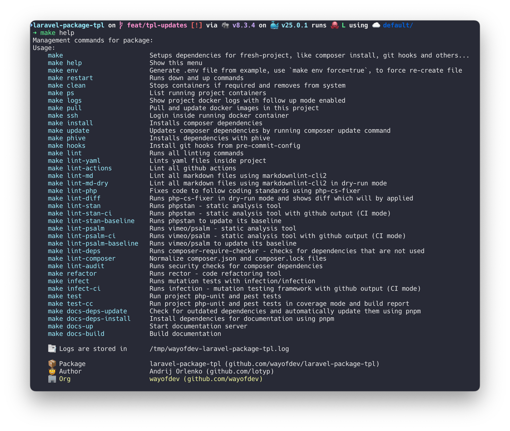

# Contributing

Welcome to our project!

We appreciate your interest in contributing. This guide will help you get started, ensuring an effective collaboration.

<br>

## 🗂 Table of Contents

* [Introduction](#-introduction)
* [Development Requirements](#-development-requirements)
  * [Optional Tools](#-optional-tools)
* [Quick Project Setup](#-quick-project-setup)
* [Using the Makefile](#-using-the-makefile)
  * [Key Commands](#-key-commands)
* [Workflow](#-workflow)
* [Docker Support](#-docker-support)
* [Continuous Integration with GitHub Actions](#-continuous-integration-with-github-actions)
* [Before You Contribute](#-before-you-contribute)
* [Commit Message Guidelines](#-commit-message-guidelines)
* [PHAR Dependencies](#-phar-dependencies)
* [Coding Standards](#-coding-standards)
  * [Composer Normalization](#-composer-normalization)
  * [Yaml Lint](#-yaml-lint)
  * [Action Lint](#-action-lint)
  * [Markdown Lint](#-markdown-lint)
  * [PHP CS Fixer](#-php-cs-fixer)
  * [Rector](#-rector)
* [Dependency Analysis](#-dependency-analysis)
* [Security Audits](#-security-audits)
* [Mutation Tests](#-mutation-tests)
* [Static Code Analysis](#-static-code-analysis)
* [Unit and Functional Tests](#-unit-and-functional-tests)
* [Pre-commit Hooks](#-pre-commit-hooks)
  * [Configured Hooks](#-configured-hooks)
  * [Installing Pre-commit Hooks](#-installing-pre-commit-hooks)

<br>

## 👋 Introduction

If you would like to contribute, please **open an issue** or a pull request. We are always looking for ways to improve the project and would love to hear your ideas.

The latest changes are always in **`master`** branch, so please make your Pull Request against that branch.

<br>

## 🚩 Development Requirements

Before you begin, you will need to set up your local development environment. Here is what you'll need:

* **Operating System**: macOS Monterey+, Linux, or Windows with WSL2.
* **Docker**: Version 26.0.0 or newer. Installation guides:
  * [Docker on Ubuntu 22.04](https://www.digitalocean.com/community/tutorials/how-to-install-and-use-docker-on-ubuntu-22-04)
  * [Docker Desktop on Mac](https://docs.docker.com/desktop/install/mac-install/)

### → Optional Tools

* **Homebrew** (macOS only)
  * Install via [brew.sh](https://brew.sh/).
* [Pre-commit](https://pre-commit.com) — Automates the running of git pre-commit hooks.
  * Installation: `brew install pre-commit` and `make hooks`
* [Cz-git](https://cz-git.qbb.sh) — Commitizen adapter, that assists in formatting git commits.
  * Installation: `brew install czg`

<br>

## 🚀 Quick Project Setup

We use a dockerized environment. Follow these steps to start working with the project:

1. **Clone this repository:**

   ```bash
   git clone git@github.com:wayofdev/laravel-symfony-serializer.git \
    && cd ./laravel-symfony-serializer
   ```

2. **Create `.env` file:**

   ```bash
   make env
   ```

3. **Install phive and composer dependencies:**

   ```bash
   make phive
   make install
   ```

<br>

## 🔧 Using the Makefile

This project uses a Makefile to streamline common development tasks. The Makefile includes utilities for managing Docker environments, installing project dependencies, running tests, and linting code.

```bash
make help
```



### → Key Commands

* `make env`: Creates a `.env` file from the `.env.example` template.
* `make install`: Installs project composer dependencies
* `make update`: Updates project composer dependencies
* `make up`: Starts all services using Docker Compose.
* `make down`: Stops and removes all services.
* `make logs`: Displays logs for all services.
* `make ssh`: Logs into the running application container for command line operations.
* `make lint`: Executes all linting procedures for YAML, PHP, and Composer files.
* `make commit`: Runs cz-git, a commitizen adapter for commit message formatting in a native environment.

For a full list of commands, run `make help`.

<br>

## 💻 Workflow

> [!IMPORTANT]
>
> Please feature/fix/update... into individual PRs (not one changing everything)

* **Fork the Repository**: Start by forking the repository to your GitHub account.
* **Create a Branch**: In your fork, create a new branch for your work. Name it appropriately based on the feature, fix, or update you're working on.
* **Make Your Changes**: Implement your changes
* **Run Tests**: Ensure all tests pass by running `make test`.
* **Update Documentation**: If you've made changes that affect the project's documentation, ensure it is updated.
* **Run Linters**: Ensure your code passes all linting checks using `make lint`.
* **Commit Your Changes**: Use the [Conventional Commits](#-commit-message-guidelines) standard for your commit messages. You can use `make commit` to assist in creating commit messages.
* **Push Your Changes**: Push your branch to your fork on GitHub.
* **Open a Pull Request**: Submit a pull request to the `master` branch of the original repository. Ensure your PR is focused, addressing a single feature, fix, or improvement.

<br>

## 🐳 Docker Support

This package leverages Docker to provide a consistent and isolated development environment. The included [`Makefile`](../Makefile) utilizes `docker-compose.yaml` along with the [wayofdev/docker-php-dev](https://github.com/wayofdev/docker-php-dev) PHP image to streamline setup and usage. This setup facilitates easy configuration of tools like XDebug for debugging and profiling, enhancing the development experience.

To run docker container:

```bash
make up
```

Other commands:

```bash
# Login inside container
$ make ssh

# Turn off containers
$ make down
```

By default, phpunit and phpstan commands will be ran against docker environment.

<br>

## 🔨 Continuous Integration with GitHub Actions

Our project employs [GitHub Actions](https://github.com/features/actions) for continuous integration, ensuring code quality and reliability. We encourage contributors to review our workflow configurations to understand the CI processes:

| Workflow                                                       | Description                                                         |
|----------------------------------------------------------------|---------------------------------------------------------------------|
| [`apply-labels.yml`](workflows/apply-labels.yml)               | Auto labels PRs based on rules.                                     |
| [`auto-merge-release.yml`](workflows/auto-merge-release.yml)   | Automatically merges release PRs.                                   |
| [`coding-standards.yml`](workflows/coding-standards.yml)       | Checks `yaml`, `md`, `composer`, `php` and commit coding standards. |
| [`create-release.yml`](workflows/create-release.yml)           | Creates a release on GitHub.                                        |
| [`dependency-analysis.yml`](workflows/dependency-analysis.yml) | Checks for dependency issues.                                       |
| [`refactoring.yml`](workflows/refactoring.yml)                 | Runs rector/rector code check.                                      |
| [`security-analysis.yml`](workflows/security-analysis.yml)     | Checks for security issues.                                         |
| [`shellcheck.yml`](workflows/shellcheck.yml)                   | Checks shell scripts.                                               |
| [`static-analysis.yml`](workflows/static-analysis.yml)         | Runs `psalm` and `phpstan` tools.                                   |
| [`testing.yml`](workflows/testing.yml)                         | Runs coverage, unit and mutation tests.                             |

<br>

## 📝 Before You Contribute

* **Tests**: Include tests that cover any new features or bug fixes.
* **Code Quality**: Utilize `make lint` for code style checks and `make lint-stan lint-psalm` for static analysis with [PHPStan](https://phpstan.org) and [Psalm](https://psalm.dev/).
* **Documentation**: Update relevant documentation to reflect your changes, ensuring other developers can understand and use your contributions effectively.
* **Commits**: use Conventional Commits standard to create a commit

<br>

## 📩 Commit Message Guidelines

We follow the [Conventional Commits](https://www.conventionalcommits.org/en/v1.0.0/) standard. Please structure your commit messages as follows, using the appropriate prefix:

**Examples:**

```bash
git commit -am 'feat: some feature was introduced'
git commit -am 'fix: something has been fixed'
```

**Allowed Prefixes:**

| Prefix      | Purpose                                                       |
|-------------|---------------------------------------------------------------|
| `feat:`     | Introduces a new feature                                      |
| `fix:`      | Fixes a bug                                                   |
| `perf:`     | Improves performance                                          |
| `docs:`     | Documentation only changes                                    |
| `style:`    | Code style changes (formatting, missing semi-colons, etc.)    |
| `deps:`     | Updates dependencies                                          |
| `refactor:` | Code changes that neither fixes a bug nor adds a feature      |
| `ci:`       | Changes to our CI configuration files and scripts             |
| `test:`     | Adding missing tests or correcting existing tests             |
| `revert:`   | Reverts a previous commit                                     |
| `build:`    | Changes that affect the build system or external dependencies |
| `chore:`    | Other changes that don't modify src or test files             |
| `security:` | A code change that fixes a security issue                     |

<br>

## 📦 PHAR Dependencies

We use [Phive](https://phar.io/) to manage PHAR dependencies. You can install all dependencies using the `make phive` command, which will be executed through the Docker environment.

```bash
make phive
```

<br>

## 🔍 Coding Standards

We enforce coding standards to maintain high code quality and readability. Here's a list of tools we use:

### → Composer Normalization

We use [`ergebnis/composer-normalize`](https://github.com/ergebnis/composer-normalize) to normalize `composer.json`.

Use:

```bash
make lint-composer
```

### → Yaml Lint

We use [`yamllint`](https://github.com/adrienverge/yamllint) to enforce coding standards in YAML files.

To lint yaml files run:

```bash
make lint-yaml
```

by default, [`cytopia/yamllint`](https://github.com/cytopia/docker-yamllint) Docker image will be used to run linter.

### → Action Lint

We use [`actionlint`](https://github.com/rhysd/actionlint) to enforce coding standards in GitHub Actions workflows.

To lint GitHub Actions run:

```bash
make lint-actions
```

by default, [`rhysd/actionlint`](https://hub.docker.com/r/rhysd/actionlint/tags) Docker image will be used to run linter.

### → Markdown Lint

We use [`markdownlint-cli2`](https://github.com/davidanson/markdownlint-cli2) to enforce coding standards in Markdown files.

To lint markdown files run:

```bash
make lint-md-dry
make lint-md
```

### → PHP CS Fixer

We use [`friendsofphp/php-cs-fixer`](https://github.com/FriendsOfPHP/PHP-CS-Fixer) together with [`wayofdev/php-cs-fixer-config`](https://github.com/wayofdev/php-cs-fixer-config) to enforce coding standards in PHP files.

Run

```bash
make lint-php
```

to automatically fix coding standard violations.

### → Rector

We use [`rector/rector`](https://github.com/rectorphp/rector) to refactor and modernize PHP code.

Run

```bash
make refactor
```

to perform code refactoring.

<br>

## 🔬 Dependency Analysis

We use [`maglnet/composer-require-checker`](https://github.com/maglnet/ComposerRequireChecker) to prevent the use of unknown symbols in production code.

Run

```bash
make lint-deps
```

to run a dependency analysis.

<br>

## 🔒 Security Audits

We use Composer's built-in audit feature to check for known vulnerabilities in dependencies.

Run

```bash
make lint-audit
```

<br>

## 🦠 Mutation Tests

We use [`infection/infection`](https://github.com/infection/infection) together with [`roave/infection-static-analysis-plugin`](https://github.com/Roave/infection-static-analysis-plugin) to ensure a minimum quality of the tests. Roave plugin is used to publish mutation score results to the [Stryker Dashboard](https://dashboard.stryker-mutator.io/).

Xdebug support is enabled by default when running commands through the `Makefile`:

```bash
make infect
```

to run mutation tests.

<br>

## 🔍 Static Code Analysis

We use both [`phpstan/phpstan`](https://github.com/phpstan/phpstan) and [`vimeo/psalm`](https://github.com/vimeo/psalm) to statically analyze the code.

Run

```bash
make lint-stan
make lint-psalm
```

to run a static code analysis.

We also use the baseline features of [`phpstan/phpstan`](https://phpstan.org/user-guide/baseline) and [`vimeo/psalm`](https://psalm.dev/docs/running_psalm/dealing_with_code_issues/#using-a-baseline-file) to ignore existing issues.

Run

```bash
make lint-stan-baseline
make lint-psalm-baseline
```

to regenerate the baselines in:

* [`../phpstan-baseline.neon`](../phpstan-baseline.neon).
* [`../psalm-baseline.xml`](../psalm-baseline.xml).

> [!IMPORTANT]
>
> Ideally, the baseline files should stay empty or shrink over time.

<br>

## 🧪 Unit and Functional Tests

We use [`phpunit/phpunit`](https://github.com/sebastianbergmann/phpunit) and [`pestphp/pest`](https://github.com/pestphp/pest) to drive the development.

Run to run all the tests:

```bash
# To run both, arch (pest) and unit (phpunit) tests
make test

# To run only arch (pest) tests
make test-arch

# To run only unit (phpunit) tests
make test-unit
```

<br>

## 📦 Pre-commit Hooks

Pre-commit hooks are an optional but highly recommended way to automate the linting and quality checks before committing changes to the repository. This project provides a predefined configuration that helps in maintaining code quality and consistency.

### → Configured Hooks

Our pre-commit configuration includes several hooks:

* **Trailing Whitespace**: Removes unnecessary trailing spaces.
* **End-of-File Fixer**: Ensures that files end with a newline.
* **Check Added Large Files**: Prevents accidentally adding large files to the git repository, with a current limit set to 600 KB.
* **Commitizen**: Ensures commit messages meet the conventional commit format. This hook is triggered at the commit message stage.
* **PHP-CS-Fixer:** Enforces coding standards in PHP files.
* **Markdown Lint:** Enforces coding standards in Markdown files.

### → Installing Pre-commit Hooks

To utilize these hooks, you first need to install them using the command provided by the Makefile:

```bash
make hooks
```

<br>
